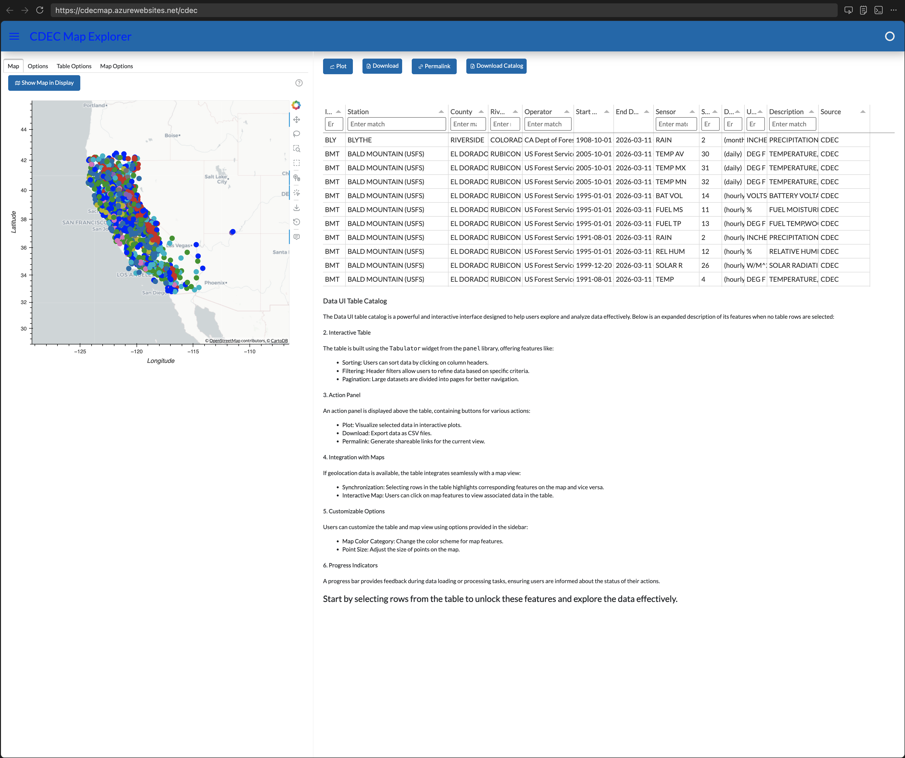

# cdec_maps

**Interactive maps and time-series dashboards for California water monitoring data from CDEC**

[](https://opensource.org/licenses/MIT)
[](https://www.python.org/downloads/)

---

## Live Dashboard

> **Try it now:** [https://cdecmap.azurewebsites.net/cdec](https://cdecmap.azurewebsites.net/cdec)



The live dashboard lets you explore California's water monitoring network interactively — select stations on a map, choose sensors and date ranges, and view time-series plots instantly in your browser, no installation required.

---

## Overview

`cdec_maps` is a Python package that provides interactive geospatial maps and time-series dashboards for data from the [California Data Exchange Center (CDEC)](https://cdec.water.ca.gov) — California's primary repository for real-time and historical water data across thousands of monitoring stations statewide.

The dashboard integrates:
- An **interactive map** of all CDEC monitoring stations with point-and-click selection
- **Time-series plots** for any combination of sensors, stations, and date ranges
- A **filterable data table** for exploring station metadata and sensor availability
- A **local disk cache** to speed up repeated data access and reduce CDEC server load

---

## Features

- **Statewide station map** — displays thousands of CDEC stations on an interactive map with tile layers (CartoLight); filter by sensor type, river basin, county, and operator
- **Multi-sensor selection** — choose one or more sensor types (River Stage, Flow, Temperature, and many more) to compare across stations
- **Configurable time range** — interactively set any start/end date range for the time-series download
- **Tidal filtering** — optional cosine-Lanczos tidal filter for high-frequency (event/hourly) data
- **Disk-cached data access** — stores downloaded CDEC data locally using `diskcache` + Parquet for fast reuse
- **Delta region filtering** — built-in support for filtering to stations within the Sacramento-San Joaquin Delta
- **CLI interface** — serve the dashboard or display sensor maps directly from the command line
- **Deployable as a web app** — built on [Panel](https://panel.holoviz.org/), deployable anywhere Panel apps can run (Azure, Heroku, bare metal, etc.)

---

## Data Source

All data is sourced from the [California Data Exchange Center (CDEC)](https://cdec.water.ca.gov), operated by the California Department of Water Resources. CDEC provides real-time and historical hydrologic data including:

| Sensor Type | Description |
|---|---|
| RIV STG | River / reservoir stage (water level) |
| FLOW | Stream flow (discharge) |
| TEMP | Water temperature |
| PRECIP | Precipitation |
| RES STG | Reservoir storage |
| ... | Many more sensor types available |

Data is available at event (15-min), hourly, daily, and monthly resolutions depending on station and sensor.

---

## Installation

### Conda (recommended)

```bash
conda env create -f environment.yml
conda activate cdec_maps
pip install -e .
```

The `environment.yml` pulls from `conda-forge` and the `cadwr-dms` channel, and installs all geospatial and visualization dependencies automatically.

### Pip

```bash
pip install -e .
```

> **Note:** Some geospatial dependencies (`cartopy`, `geopandas`) are best installed via conda to avoid build issues.

---

## Quick Start

### Launch the dashboard locally

```bash
panel serve cdec_maps/cdec_maps_servable.py 
```

Then open [http://localhost:5006](http://localhost:5006) in your browser.

### CLI commands

```bash
# Show all stations on an interactive map
cdec_maps show-all-stations

# Show all sensor data with map-based station selection
cdec_maps show-all-sensors

# Check version
cdec_maps --version
```

### Python API

```python
from cdec_maps import cdecuimgr
import panel as pn

pn.extension()

# Create and display the full dashboard
ui = cdecuimgr.show_cdec_ui()
ui.show()
```

```python
# Read station data directly
from cdec_maps import cdec

reader = cdec.Reader()

# Fetch all stations
stations = reader.read_all_stations()

# Fetch time-series for a specific station/sensor
df = reader.read_station_data(
    station_id="FOL",
    sensor_number=23,
    duration_code="D",   # D=daily, H=hourly, E=event, M=monthly
    start="2024-01-01",
    end="2024-12-31"
)
```

---

## Building the Data Cache

The package ships with a local Parquet database under `cdec_db/`. To refresh or rebuild the cache from CDEC:

```bash
# Download station metadata only
python -m cdec_maps.cdec_cache_build  # calls download_all_stations_info()

# Download all station data (time-series) — can take a long time
python build_cdec_cache.py
```

Or using the provided shell script:

```bash
bash run_server_cache_build.sh
```

---

## Architecture

```
cdec_maps/
├── cdec.py                  # CDEC data reader: fetches & caches data from cdec.water.ca.gov
├── cdecuimgr.py             # Main UI manager (CDECDataUIManager) — wires data to dashboard
├── cdec_maps_servable.py    # Panel servable entry point
├── maps.py                  # Geospatial utilities (GeoDataFrame conversion, Delta filtering)
├── map_selection_display.py # Map widget with clickable station selection
├── panels.py                # Panel-based single-station multi-sensor viewer
├── cli.py                   # Click-based CLI
├── cdec_cache_build.py      # Bulk cache builder
└── Delta_Simplified.geojson # Sacramento-San Joaquin Delta boundary polygon
```

**Key technology stack:**

| Component | Library |
|---|---|
| Dashboard framework | [Panel](https://panel.holoviz.org/) |
| Interactive plots | [HoloViews](https://holoviews.org/) + [hvPlot](https://hvplot.holoviz.org/) |
| Geospatial maps | [GeoViews](https://geoviews.org/) + [GeoPandas](https://geopandas.org/) |
| Map tiles & rendering | [Bokeh](https://bokeh.org/) + [Cartopy](https://scitools.org.uk/cartopy/) |
| Data processing | [Pandas](https://pandas.pydata.org/) + [Dask](https://dask.org/) |
| Data storage | [PyArrow](https://arrow.apache.org/docs/python/) (Parquet) + [diskcache](https://grantjenks.com/docs/diskcache/) |
| Time-series UI framework | [dvue](https://github.com/CADWRDeltaModeling/dvue) |

---

## Deployment

The live dashboard is deployed on **Azure App Service** and served via `panel serve`. To deploy your own instance:

```bash
# Serve the app (as used in production)
panel serve cdec.py --address 0.0.0.0 --port 80 --allow-websocket-origin="*"
```

See [`run_server.sh`](run_server.sh) for the production startup script.

---

## Development

### Run tests

```bash
pytest tests/
```

### Environment setup (dev)

```bash
conda env create -f environment.yml
conda activate cdec_maps
pip install -e .
```

---

## Contributing

Contributions are welcome! Please open an issue or pull request on [GitHub](https://github.com/dwr-psandhu/cdec-maps).

---

## License

MIT License. See [LICENSE](LICENSE) for details.

---

## Authors

**Nicky Sandhu** — California Department of Water Resources, Delta Modeling Section  
Contact: psandhu@water.ca.gov  
GitHub: [CADWRDeltaModeling/cdec-maps](hhttps://github.com/CADWRDeltaModeling/cdec_maps)
